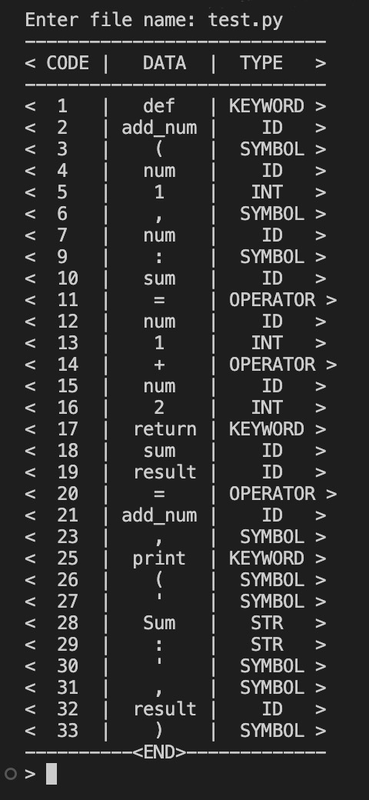
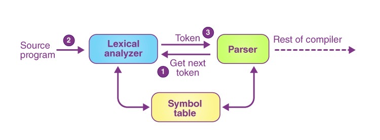

# Lexical-Analyser
### Sample Code
```python
# This a test file for experiment

def add_num(num1, num2):
    sum = num1 + num2
    return sum

result = add_num(5, 4)

print('Sum: ', result)

# Output: Sum: 9

```

### Result
<p></p>

## Description
Lexical Analysis is the first phase of the compiler also known as a scanner. It converts the High level input program into a sequence of Tokens.

Token: A lexical token is a sequence of characters that can be treated as a unit in the grammar of the programming languages.
<p></p>

### Roles of the Lexical analyzer:

- The lexical analyzer is responsible for removing the white spaces and comments from the source program.
- The input characters are read by the lexical analyzer from the source code.
- It helps to identify the tokens.
- It corresponds to the error messages with the source program.
