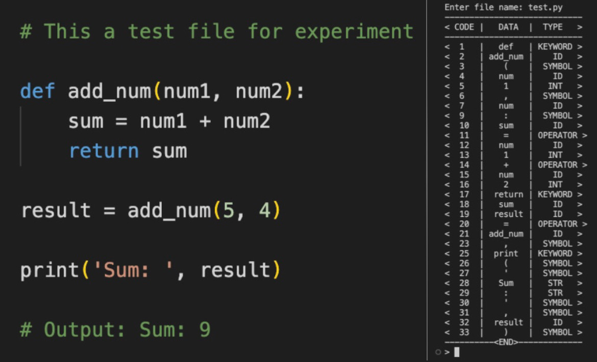

<h1 id="lexical-analyser">Lexical-Analyser</h1>
<h2 id="sreen-shot">Sreen Shot</h2>

<h2 id="description">Description</h2>

Lexical Analysis is the first phase of the compiler also known as a scanner. It converts the High level input program into a sequence of Tokens.

Token: A lexical token is a sequence of characters that can be treated as a unit in the grammar of the programming languages. 

Roles of the Lexical analyzer:

<ul>
<li>The lexical analyzer is responsible for removing the white spaces and comments from the source program.</li>
<li>The input characters are read by the lexical analyzer from the source code.</li>
<li>It helps to identify the tokens.</li>
<li>It corresponds to the error messages with the source program.</li>
</ul>
